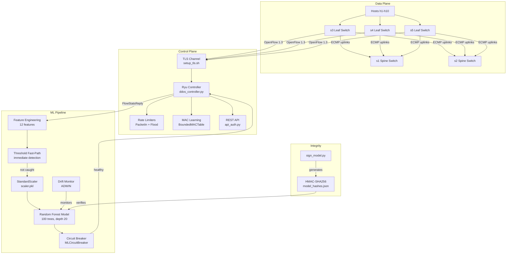
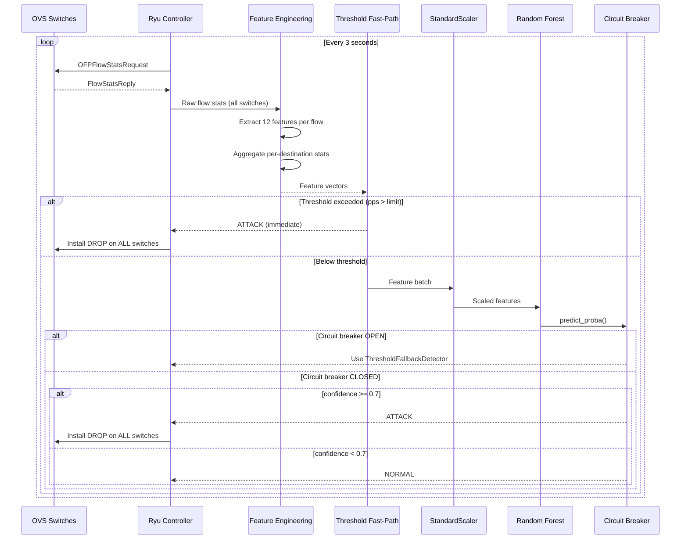

# Architecture

## Overview

This system combines Software-Defined Networking (SDN) with machine learning to detect and mitigate DDoS attacks in real time. A Ryu OpenFlow 1.3 controller sits between the data plane (Open vSwitch instances in a spine-leaf topology) and an application-layer Random Forest classifier. The controller polls flow statistics every 3 seconds, extracts 12 features per flow (including aggregate per-destination behavior), and classifies them using a two-stage detection pipeline.

The first stage is a threshold-based fast-path that catches obvious volumetric attacks immediately. The second stage runs a Random Forest model with `predict_proba()` and a configurable confidence threshold (default 0.7). When an attack is detected, the controller installs DROP rules across all switches in the network for network-wide mitigation. The system is validated against three real-world datasets (CIC-IDS2017, CIC-DDoS2019, UNSW-NB15) and includes 91 automated tests.

The architecture prioritizes defense-in-depth: HMAC-SHA256 model integrity verification prevents pickle deserialization attacks, BCP38 anti-spoofing rules are installed at leaf switches, TLS secures the OpenFlow channel, and a circuit breaker with ADWIN drift detection provides reliability when the ML model fails or drifts.

## Component Architecture

## Detection Sequence

## Component Table

| Component | Purpose | Technology | Key Files |
|-----------|---------|------------|-----------|
| Controller | L2 forwarding, flow stats polling, attack mitigation | Ryu OpenFlow 1.3, eventlet | `controller/ddos_controller.py` |
| Feature Engineering | 12-feature extraction, aggregate stats | NumPy, pandas | `ml/feature_engineering.py` |
| Model Training | RF training, cross-validation, baselines | scikit-learn | `ml/train.py` |
| Model Evaluation | ROC curves, performance metrics | scikit-learn, matplotlib | `ml/evaluation.py` |
| Dataset Adapters | Map real datasets to 12-feature schema | pandas | `ml/dataset_adapters/` |
| Circuit Breaker | ML failure isolation, threshold fallback | Custom (Fowler pattern) | `ml/circuit_breaker.py` |
| Drift Detector | ADWIN-based concept drift monitoring | river | `ml/drift_detector.py` |
| Bounded Caches | Memory-safe MAC/IP/flood tables | cachetools | `utils/bounded_cache.py` |
| API Auth | Token-based REST API authentication | Custom middleware | `controller/api_auth.py` |
| Topology | Mininet spine-leaf network creation | Mininet, OVS | `topology/topology.py` |
| Topology Config | ECMP groups, port mappings, priorities | Python constants | `config/topology_config.py` |
| Model Signing | HMAC-SHA256 hash generation for .pkl files | hashlib, hmac | `scripts/sign_model.py` |

All paths relative to `src/sdn_ddos_detector/`.

## Design Decisions

| Decision | Rationale | Alternatives Considered |
|----------|-----------|------------------------|
| ECMP via group tables instead of STP | STP blocks redundant paths, wasting spine-leaf bandwidth; ECMP uses all uplinks | STP (simpler but wastes bandwidth), static routes |
| HMAC-SHA256 model integrity instead of signatures | Simpler key management for research prototype; symmetric key from env var | RSA/ECDSA signatures (better for production), no verification |
| ADWIN drift detection instead of EMA | ADWIN adapts window size automatically; EMA with fixed alpha masks gradual drift | Fixed-window statistics, EMA (masked drift in audit), CUSUM |
| eventlet green threads instead of asyncio | Ryu requires eventlet; all concurrency must use eventlet primitives | asyncio (incompatible with Ryu), threading (GIL contention) |
| `src/` layout instead of flat | Standard Python packaging, prevents import confusion, enables `pip install -e .` | Flat layout (simpler but fragile imports with sys.path hacks) |
| Network-wide DROP instead of per-switch | Attackers can reach victims via multiple paths in spine-leaf; single-switch blocks are incomplete | Per-switch blocking (audit finding 2.4 showed bypass) |
| Threshold fast-path + ML slow-path | Obvious volumetric attacks need immediate response; ML handles subtle patterns | ML-only (3-5s latency for all attacks), threshold-only (no subtlety) |
| Random Forest instead of deep learning | Interpretable, fast inference, works well with tabular data at this scale | Neural networks (overkill), XGBoost (marginal gains, more complexity) |
| BCP38 anti-spoofing at leaf switches | Prevents source IP spoofing at ingress; reduces false positives from spoofed flows | No anti-spoofing (allows evasion), core-level filtering (too late) |

## Two-Stage Detection

The detection pipeline uses two stages to balance latency and accuracy:

**Stage 1: Threshold Fast-Path (immediate)**
- Checks packet-per-second and byte-per-second rates against configurable thresholds
- Catches obvious volumetric attacks without waiting for ML inference
- Latency: < 1ms after stats reply arrives

**Stage 2: ML Slow-Path (~4.5s total)**
- 3s polling interval + ~0.5s feature extraction + ~0.5s ML inference + ~0.5s rule installation
- Random Forest with `predict_proba()` and confidence threshold
- Circuit breaker falls back to threshold-only if ML fails repeatedly
- ADWIN monitors prediction distribution for concept drift

When the circuit breaker is OPEN (ML has failed too many times), only the threshold fast-path operates. The circuit breaker transitions back to CLOSED after a configurable cool-down period with successful predictions.

## File Structure Mapping

For upgraders from v2.1.0 to v3.0.0:

| v2.x Path | v3.0.0 Path |
|-----------|-------------|
| `sdn_controller/mitigation_module.py` | `src/sdn_ddos_detector/controller/ddos_controller.py` |
| `sdn_controller/ryu.conf` | `ryu.conf` (project root) |
| `ml_model/train_model.py` | `src/sdn_ddos_detector/ml/train.py` |
| `ml_model/create_roc.py` | `src/sdn_ddos_detector/ml/evaluation.py` |
| `datasets/generate_full_dataset.py` | `src/sdn_ddos_detector/ml/generate_synthetic_dataset.py` |
| `network_topology/topology.py` | `src/sdn_ddos_detector/topology/topology.py` |
| `traffic_generation/generate_normal.py` | `src/sdn_ddos_detector/traffic/generate_normal.py` |
| `utilities/feature_extractor.py` | `src/sdn_ddos_detector/ml/feature_engineering.py` |
| `utilities/dataset_collector.py` | `src/sdn_ddos_detector/utils/dataset_collector.py` |
| `utilities/performance_monitor.py` | `src/sdn_ddos_detector/utils/performance_monitor.py` |
| `logs/analyze_logs.py` | `src/sdn_ddos_detector/scripts/analyze_logs.py` |
| `requirements.txt` | `pyproject.toml` |
| N/A (new) | `src/sdn_ddos_detector/ml/circuit_breaker.py` |
| N/A (new) | `src/sdn_ddos_detector/ml/drift_detector.py` |
| N/A (new) | `src/sdn_ddos_detector/ml/dataset_adapters/` |
| N/A (new) | `src/sdn_ddos_detector/controller/api_auth.py` |
| N/A (new) | `src/sdn_ddos_detector/utils/bounded_cache.py` |
| N/A (new) | `src/sdn_ddos_detector/config/topology_config.py` |
| N/A (new) | `src/sdn_ddos_detector/scripts/sign_model.py` |
